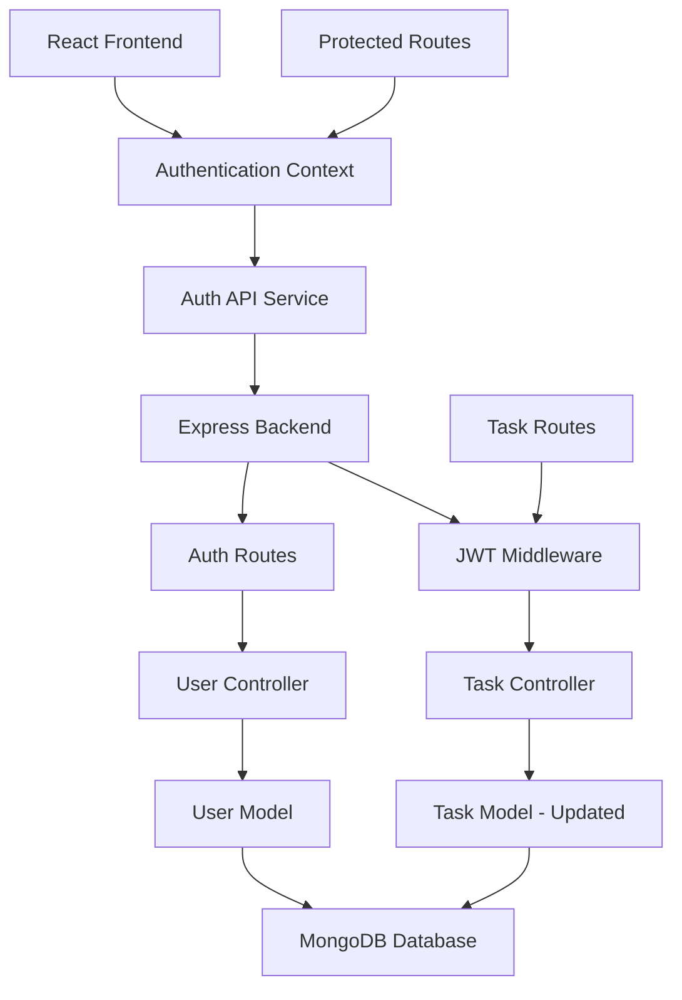
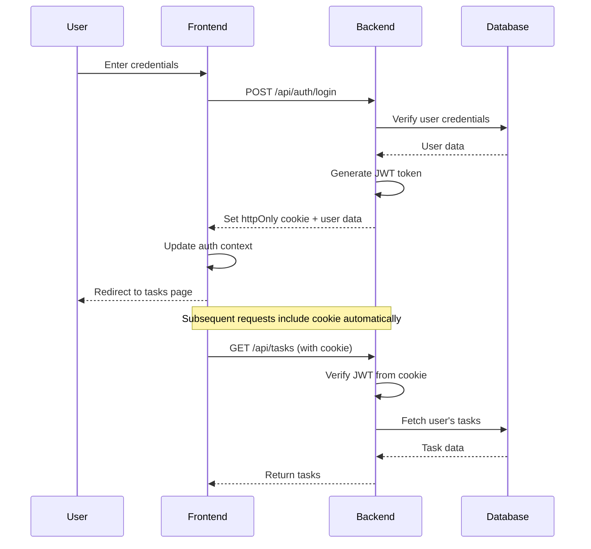

# Design Document: User Authentication System

## Overview

This design document outlines the implementation of a secure user authentication system for the existing todo application. The system will integrate JWT-based authentication with the current React frontend and Node.js/Express backend, ensuring seamless user experience while maintaining security best practices.

The authentication system will use httpOnly cookies for token storage to prevent XSS attacks, implement proper password hashing with bcrypt, and provide session persistence across browser sessions. All new components will follow the existing design patterns and CSS variable system for consistent theming.

## Architecture

### High-Level Architecture



### Authentication Flow



## Components and Interfaces

### Frontend Components

#### 1. Authentication Context (`AuthContext.js`)
- Manages global authentication state
- Provides login, logout, and user state management
- Handles token refresh and session persistence
- Integrates with existing theme system

#### 2. Login Page (`LoginPage.js`)
- Email and password input form
- Error message display
- Link to signup page
- Follows existing component styling patterns

#### 3. Signup Page (`SignupPage.js`)
- User registration form with email, password, and confirm password
- Client-side validation
- Error message display
- Link to login page

#### 4. Protected Route Component (`ProtectedRoute.js`)
- Wraps existing routes to require authentication
- Redirects unauthenticated users to login
- Maintains intended destination for post-login redirect

#### 5. Updated Header Component
- Add logout functionality
- Display current user email
- Maintain existing theme toggle functionality

### Backend Components

#### 1. User Model (`User.js`)
```javascript
{
  email: String (unique, required),
  password: String (hashed, required),
  createdAt: Date,
  updatedAt: Date
}
```

#### 2. Updated Task Model
```javascript
{
  // Existing fields...
  userId: ObjectId (required, references User)
}
```

#### 3. Authentication Routes (`/api/auth`)
- `POST /register` - User registration
- `POST /login` - User login
- `POST /logout` - User logout
- `GET /me` - Get current user info

#### 4. JWT Middleware (`authMiddleware.js`)
- Validates JWT tokens from httpOnly cookies
- Adds user information to request object
- Handles token expiration and errors

#### 5. Updated Task Routes
- Add authentication middleware to all task endpoints
- Filter tasks by authenticated user
- Maintain existing API structure

## Data Models

### User Schema
```javascript
const userSchema = new mongoose.Schema({
  email: {
    type: String,
    required: true,
    unique: true,
    lowercase: true,
    trim: true,
    validate: [validator.isEmail, 'Please provide a valid email']
  },
  password: {
    type: String,
    required: true,
    minlength: 6
  },
  createdAt: {
    type: Date,
    default: Date.now
  },
  updatedAt: {
    type: Date,
    default: Date.now
  }
});
```

### Updated Task Schema
```javascript
const taskSchema = new mongoose.Schema({
  // All existing fields remain the same...
  userId: {
    type: mongoose.Schema.Types.ObjectId,
    ref: 'User',
    required: true
  }
  // ... rest of existing schema
});
```

## Security Implementation

### Password Security
- Use bcrypt with salt rounds of 12 for password hashing
- Implement password strength validation on frontend and backend
- Never store or log plain text passwords

### Token Management
- JWT tokens stored in httpOnly cookies to prevent XSS attacks
- Tokens expire after 24 hours for security
- Secure cookie settings: `httpOnly: true, secure: true (production), sameSite: 'strict'`
- No refresh token implementation for simplicity (user re-authenticates after expiration)

### API Security
- All task-related endpoints require authentication
- User data isolation through userId filtering
- Input validation and sanitization
- Rate limiting on authentication endpoints (future enhancement)

## Error Handling

### Frontend Error Handling
- Display user-friendly error messages for authentication failures
- Handle network errors gracefully
- Provide clear feedback for validation errors
- Maintain error state in authentication context

### Backend Error Handling
- Standardized error response format
- Appropriate HTTP status codes
- Secure error messages (no sensitive information leakage)
- Comprehensive logging for debugging

## Correctness Properties

*A property is a characteristic or behavior that should hold true across all valid executions of a system—essentially, a formal statement about what the system should do. Properties serve as the bridge between human-readable specifications and machine-verifiable correctness guarantees.*

### Property 1: User Registration Validation
*For any* email and password input, the registration system should accept valid combinations (proper email format, password ≥ 6 characters) and reject invalid combinations with appropriate error messages
**Validates: Requirements 1.1, 1.3, 1.4**

### Property 2: Authentication Round Trip
*For any* successfully registered user, logging in with their correct credentials should authenticate them and establish a valid session
**Validates: Requirements 1.5, 2.1, 2.3**

### Property 3: Session Persistence
*For any* authenticated user, their session state should persist across page refreshes and be clearable through explicit logout
**Validates: Requirements 3.1, 3.2, 3.4**

### Property 4: Data Isolation
*For any* set of users and their tasks, each user should only be able to access, view, and modify their own tasks, with complete isolation from other users' data
**Validates: Requirements 4.1, 4.2, 4.4**

### Property 5: Route Protection
*For any* protected route, unauthenticated users should be redirected to the login page, while authenticated users should have access
**Validates: Requirements 4.3, 6.3**

### Property 6: Theme Integration
*For any* theme change (light/dark), all authentication pages should reflect the theme change consistently with the rest of the application
**Validates: Requirements 5.2**

### Property 7: Password Security
*For any* user password, it should be hashed using secure algorithms before storage and never stored in plain text
**Validates: Requirements 7.1, 8.3**

### Property 8: Token Security
*For any* authentication token, it should be generated securely, validated properly on protected endpoints, and stored in httpOnly cookies
**Validates: Requirements 7.3, 7.4**

### Property 9: API Authentication
*For any* API request to protected endpoints, the system should validate authentication tokens and filter data by the authenticated user
**Validates: Requirements 7.4, 8.4**

### Property 10: Error Handling Consistency
*For any* authentication error scenario, the system should return appropriate error messages without exposing sensitive information
**Validates: Requirements 7.5**

## Testing Strategy

The authentication system will be validated through both unit tests and property-based tests to ensure correctness and security.

### Unit Testing Approach
- Test specific authentication scenarios and edge cases
- Verify error handling for invalid inputs (duplicate emails, incorrect credentials)
- Test UI component rendering and navigation links
- Validate integration between frontend and backend components
- Test specific examples like CSS styling consistency

### Property-Based Testing Approach
- Use Jest for unit tests and fast-check for property-based testing
- Minimum 100 iterations per property test
- Each property test tagged with: **Feature: user-authentication, Property {number}: {property_text}**
- Properties validate universal behaviors across all valid inputs
- Focus on security properties, data isolation, and authentication flows